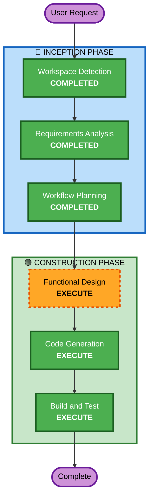

# Execution Plan

## Detailed Analysis Summary

### Change Impact Assessment
- **User-facing changes**: Yes - Entire game is user-facing
- **Structural changes**: N/A - Greenfield project
- **Data model changes**: No - Only localStorage for high scores
- **API changes**: No - Client-side only application
- **NFR impact**: Yes - Performance (60fps), Responsiveness (viewport scaling)

### Risk Assessment
- **Risk Level**: Low
- **Rollback Complexity**: Easy (greenfield, no existing users)
- **Testing Complexity**: Simple (browser-based, manual testing)

## Workflow Visualization



## Text Alternative

```
Phase 1: INCEPTION
- Stage 1: Workspace Detection (COMPLETED)
- Stage 2: Requirements Analysis (COMPLETED)
- Stage 3: Workflow Planning (COMPLETED)

Phase 2: CONSTRUCTION
- Stage 4: Functional Design (EXECUTE)
- Stage 5: Code Generation (EXECUTE)
- Stage 6: Build and Test (EXECUTE)
```

## Phases to Execute

### 🔵 INCEPTION PHASE
- [x] Workspace Detection (COMPLETED)
- [x] Requirements Analysis (COMPLETED)
- [x] Workflow Planning (COMPLETED)
- Reverse Engineering - SKIP
  - **Rationale**: Greenfield project, no existing codebase to analyze
- User Stories - SKIP
  - **Rationale**: Single user type (player), simple game mechanics, no complex user journeys
- Application Design - SKIP
  - **Rationale**: Single-page game with well-understood architecture (game loop pattern). No service layers or component dependencies to define.
- Units Generation - SKIP
  - **Rationale**: Single unit of work. The entire game is one cohesive component (HTML + JS + CSS).

### 🟢 CONSTRUCTION PHASE
- [ ] Functional Design - EXECUTE
  - **Rationale**: Game has business logic (physics, collision detection, scoring, difficulty progression) that benefits from upfront design
- NFR Requirements - SKIP
  - **Rationale**: NFRs are simple and already captured in requirements (60fps, responsive). No complex performance or security patterns needed for a client-side game.
- NFR Design - SKIP
  - **Rationale**: NFR Requirements skipped, no NFR patterns to incorporate
- Infrastructure Design - SKIP
  - **Rationale**: No infrastructure. Static HTML/JS/CSS served directly from filesystem or any static host.
- [ ] Code Generation - EXECUTE (ALWAYS)
  - **Rationale**: Implementation of the game required
- [ ] Build and Test - EXECUTE (ALWAYS)
  - **Rationale**: Build verification and testing instructions needed

### 🟡 OPERATIONS PHASE
- Operations - PLACEHOLDER
  - **Rationale**: No deployment infrastructure planned

## Estimated Timeline
- **Total Stages to Execute**: 3 (Functional Design, Code Generation, Build and Test)
- **Estimated Duration**: Medium (single session)

## Success Criteria
- **Primary Goal**: Working Flappy Bird clone with truck/road theme playable in browser
- **Key Deliverables**:
  - index.html with embedded or linked game code
  - Responsive full-window canvas game
  - Truck character, road barrier obstacles, scoring, difficulty progression
  - Sound effects integration
  - Title screen, gameplay, and game over flow
- **Quality Gates**:
  - Game runs at 60fps in modern browsers
  - Collision detection works correctly
  - Score persists across sessions via localStorage
  - Responsive to window resize
